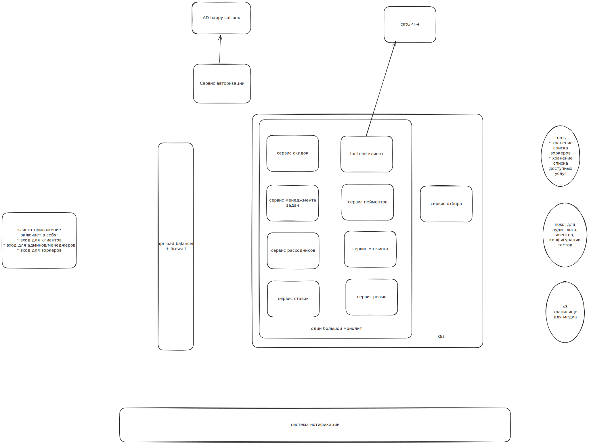

# Домашка номер ноль

## Задача
Написать описание системы, которое уйдёт разработчикам и по которому они будут писать код.
Описание должно состоять из:
- Структура системы (общая диаграмма, что где находится и как элементы связаны между собой)
- Описания, почему были выбраны те или иные варианты:
  - почему были выбраны именно такие части системы, которые вы выбрали
  - почему была выбрана именно такая структура (монолит, сервисы или микс)
  - почему были выбраны именно такие коммуникации (если это не один большой монолит)
  - спорные места и (или) места, которые вам кажутся критичными на данный момент

## Решение

### FR
- Существует приложение клиент с дэшбордом, который позволяет list/request услуги
- интеграция с котами из happy cat box (чтобы получить список котов-тестировщиков (клиентов))
- админка с перечнем списка доступных услуг и возможность редактировать
- сервис скидок
- сервис мэтчинга
- клиентское-приложение для кота-воркера
- сервис отбора (заявки, тесты, т.д.)
- пул котов-воркеров с характеристиками
- состояния задач -- в работе, выполнено, отменено
- сервис учета расходников
- стороний сервис fur-tune для предсказания будущего для кота
- сервис для рандомной проверки задач воркеров
- отмененные / проваленные заказы изучаются специальным отделом
- пэймент сервис, которые списывает деньги, выставляет счета и т.д.
- аудит лог для списания и начисления денег с комментариями
- сервис ставок на результат выполнения определенных задач
- сервис нотификаций

### NFR
- 1к запросов в день + защита от ддос - сервис отбора
- низкий ТТМ (Time To Market), чтобы конкурировать на рынке
- не будет превышать 10 заказов в день и 100 клиентов. Воркеров будет около 20 котов.

### Общие комментарии
- На структурной диаграмме только основные компоненты, небольшие комментарии к деплойменту.
- На диаграмме не отражены взаимодействия между сервисами, только их наличие.
- На диаграмме не понятен юзер флоу (как клиент, как админ, как воркер) -- для этого необходимы дополнительные диаграмы, пропускаю их для экономии времени

### Структура системы

#### Комментарии
Все сервисы кроме сервиса отбора могут быть в одном монолите, т.к.
- необходим быстрый ТТМ, а значит самый простой вариант самый лучший на текущий момент
- нет необходимости в масштабировании, т.к. ожидаем небольшой трафик
- на текущий момент только сервис отбора может быть заддосен, поэтому он вынесен в отдельный сервис с отдельным деплойментом

На системе выделены основные необходимые сервисы, сторонние сервисы, базы данных

Важная фича -- аудит лог. Все действия с заказами клиента и работой воркера должы ивентиться в аудит лог.
Это позволит в будущем восстановить состояние системы на любой момент времени, а также отследить ошибки и мошенничество.

### TODO (по-хорошему)
- Добавить диаграммы юзер флоу
- Добавить взаимодействия между сервисами
- Добавить диаграммы сущностей и их связей
