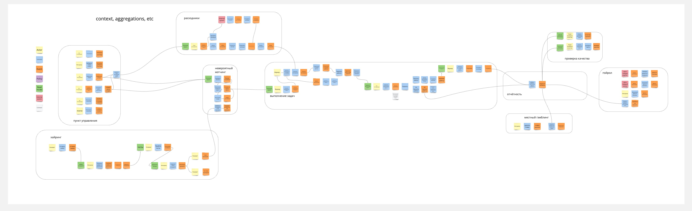
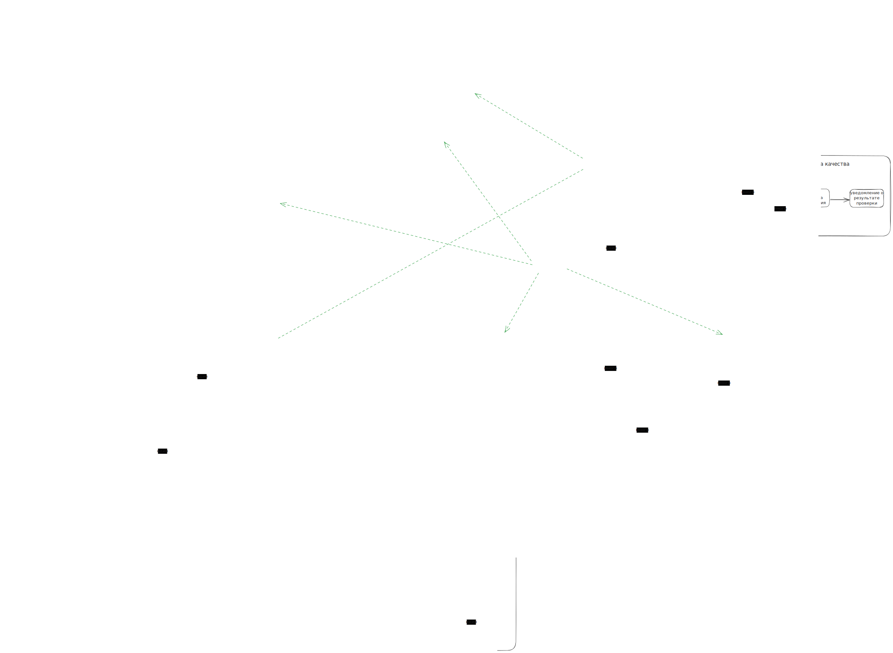

# Домашка номер один

## ES модель проекта

ПДФ версия: [hw1-es.pdf](./hw1-es.pdf)

## Модель данных системы
Возможно, я придумал новую абстракию -- отчёт. В моей схеме отчёт это не отчёт пользователя, о общее описание выполненной задачи, с фидьбеком пользователя и логами от расходников, воркера и т.д.

## Коммуникации в системе

## Гипотетическая структура проекта
Все сервисы кроме сервиса отбора могут быть в одном монолите, т.к.
- необходим быстрый ТТМ, а значит самый простой вариант самый лучший на текущий момент
- нет необходимости в масштабировании, т.к. ожидаем небольшой трафик
- на текущий момент только сервис хайринга может быть заддосен, поэтому он вынесен в отдельный сервис с отдельным деплойментом

Важная фича -- аудит лог. Все действия с заказами клиента и работой воркера должы ивентиться в аудит лог.
Это позволит в будущем восстановить состояние системы на любой момент времени, а также отследить ошибки и мошенничество.
